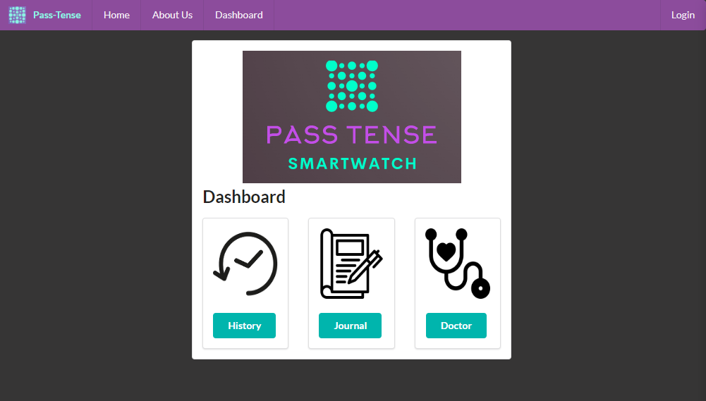

    

# Pass-Tense: A Smart Watch for Anxiety Control

_Project Aims:_
* Model a wearable medical device that assists in providing a solution for individuals with frequent anxiety attacks.
* Create a connection to the user's EMR to assist clinical staff in continuity of care.
* Accompanying application (web/mobile) for users to track progress, stay connected, and in control.

_Web Application Screenshot:_
# 

## Links
* [Project Proposal PDF](https://pi.cs.oswego.edu/~klopane/bhi504/Pass-Tense_Proposal.pdf)
* [E-Portfolio](https://pi.cs.oswego.edu/~klopane/passtense/bhi504_eportfolio/PassTensePortfolio.html)
